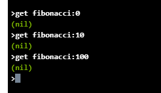
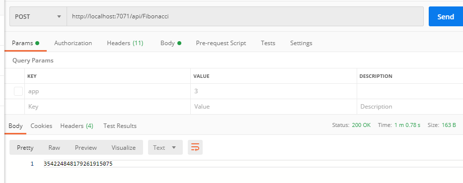
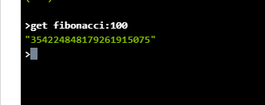
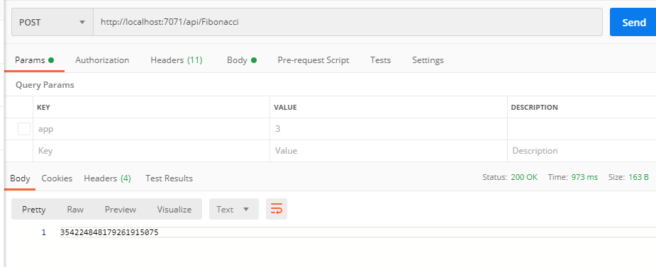
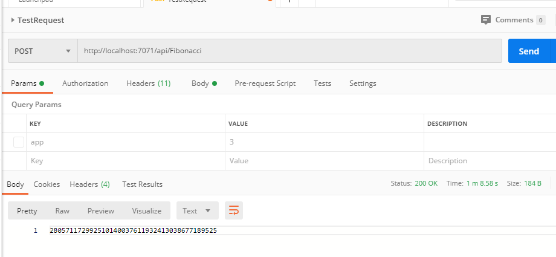

## Laboratorio final ARSW

### Integrantes:
- Jeisson Sanchez
- Mateo Gonzalez

### Algunos comandos
~~~
    Limpiar todos los registros: flushall

    eliminar un registro especifico: del key

    actualizar llave: set key value

    consultar llave: get key

~~~

### Paquetes para correr function app
Instalar dentro del directorio de la function app

- Big-Integer
- redis
- Blue Bird

### Instalar paquetes para correr local la app
~~~
    npm install -g azure-functions-core-tools
~~~

~~~
    npm install -g azure-functions-core-tools@3
~~~

### Run function app

~~~
    func start
~~~

### Casos de analizis localhost

*Tiempo de repuesta n=100 sin memoria*

*Tiempo:* 1 min 0.78 seg

*Tiempo de respuesta n=100 con memoria*

*Tiempo:* 973 ms

*Tiempo de respuesta n=200 con 100 en memoria*

