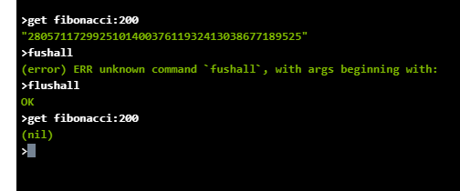

## Laboratorio final ARSW

### Integrantes:
- Jeisson Sanchez
- Mateo Gonzalez

### Algunos comandos
~~~
    Todas las llaves y valores: keys patron

    Limpiar todos los registros: flushall

    eliminar un registro especifico: del key

    actualizar llave: set key value

    consultar llave: get key

~~~

### Paquetes para correr function app
Instalar dentro del directorio de la function app

- Big-Integer
- redis
- Blue Bird

### Instalar paquetes para correr local la app
~~~
    npm install -g azure-functions-core-tools
~~~

~~~
    npm install -g azure-functions-core-tools@3
~~~

### Run function app

~~~
    func start
~~~

**Nota:** Entiendase los casos sin memoria como aquellos casos en que la base de datos redis no tiene datos almacenados con los cuales calcular y por lo tanto debe realizar todo el calculo y guardar en la base de datos.

La base de datos redis que se utiliza para todos los siguientes expermentos esta alojada en azure

### Casos de analizis localhost

**Tiempo de repuesta n=100 sin memoria**

**Tiempo:** 1 min 0.78 seg

**Tiempo de respuesta n=100 con memoria**

**Tiempo:** 973 ms

**Tiempo de respuesta n=200 con 100 en memoria**

**Tiempo:** 1 min 8.58 seg

**Tiempo de repuesta para n=200 sin memoria**

*Tiempo:* 2 min 47.58 seg

### Casos de analizis Azure

**Tiempo de repuesta n=100 sin memoria**

**Tiempo:** 1 min 12.30 s

**Tiempo de respuesta n=100 con memoria**

**Tiempo:** 2.02 seg

**Tiempo de respuesta n=200 con 100 en memoria**

**Tiempo:** 1 min 12.97 seg

**Tiempo de repuesta para n=200 sin memoria**

**Tiempo:** 2 min 24.96 seg

**Caso n=1000**
Falla al primer intento pero logro guardar data en cache

Guardo aproximadamente hasta n=240

Falla al segundo intento con los valores precargados

Logro cargar aproximadamente hasta n=450

El finalmente responde al tercer intento

Aqui pudimos evidenciar que entre mas pequeño sea el callback de la recursion el puede calcular mas valores dado que tuvimos 240, 210 y 500

**Ahora vamos a poner un tiempo de expiracion n=30**

Ejecutamos newman run json.test -n 20

Aqui podemos evidenciar que despues de 1 min 11 seg las peticiones se ejecutaron con tiempo muy similares en milisegundos, debemos recordar que siempre el primer valor n=1 va a vencer primero que n=2 asi sucesibamente hasta n=100, en momento que vensa n=100 se va a hacer necsario recalcular todos en otras palabras para fibonacci(100) despues de 30 segundos se deberia volver a recalcular todos los fibonaccis anteriores, ahora la pregunta es efectibamente expiraron.

Efectivamente ellos murieron a los 30 segundos aunque no lo pudimos evidenciar Ahora vamos a mirar para 3 segundos en este caso nos deberia ser posible evidenciar este comportamiento

Aqui si miramos la primera y 16va iteracion podemos ver que en estas iteraciones los tiempo de carga para n=100 son de 1 minuto y es debido a que en estas iteraciones debio ser cargado de nuevo los valores de los fibonaccis anteriores hasta 100
